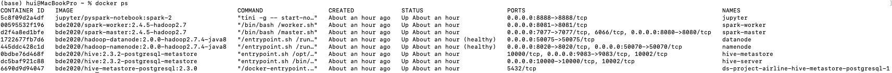
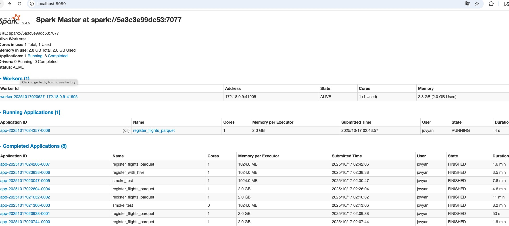

# ds-project-airline
This is an end to end data science project using Hadoop(HDFS) / Hive / Spark (PySpark) / Postgres (Hive metastore) / Jupyter / PyTorch to build a machine learning model to predict flight arrival delays using a comprehensive 2006 U.S. flight dataset.

---

## Goal:
Predict whether a flight will be delayed on arrival (≥15 minutes) based on scheduled and actual flight information.

---

## Dataset:
Airline On-Time Performance dataset from 2003 to 2008 and airports.csv from Havard Dataverse [Link](https://dataverse.harvard.edu/dataset.xhtml?persistentId=doi:10.7910/DVN/HG7NV7)

---

## Implementation:

### Step 1: Set up Docker Environment.(docker-compose.yml)

docker compose: full stack (NameNode, DataNode, HiveServer2 with embedded Derby metastore persisted locally, and Jupyter/PySpark).


```bash
# Use the fixed compose file if your local docker-compose.yml is corrupted:
docker compose -f docker-compose.fixed.yml up -d

#Check service logs (useful if Hive metastore schema init fails):
docker-compose logs -f hive-metastore
docker-compose logs -f metastore-init

# Stop and remove containers + volumes (clean start):
docker-compose down -v

# Quick HDFS & Hive tips once the stack is up:
# List HDFS root:
docker exec -it ds_namenode hdfs dfs -ls /

# Create landing directory and copy a local CSV into HDFS (example):
docker exec -it ds_namenode hdfs dfs -mkdir -p /data/flight2006/raw
docker cp path/to/2006.csv ds_namenode:/tmp/2006.csv
docker exec -it ds_namenode hdfs dfs -put /tmp/2006.csv /data/flight2007/raw/

# Start Beeline (connect to HiveServer2) from inside the hive-server container:
docker exec -it ds_hive_server bash -c "beeline -u 'jdbc:hive2://localhost:10000/default' -n hive -p hive_password"
```

Then create external Hive tables over the HDFS CSVs or convert CSV to Parquet with PySpark and create external tables over Parquet for performance.

- Scripts to ingest the 2006 flights CSV and `airports.csv` into HDFS and create Hive external tables.
- A small PySpark ETL that reads the Hive tables, cleans fields, engineers 6-8 simple features and writes a Parquet feature table.


### Step 2: Download data, copy into the Hadoop container and put into Hadoop Distributed File System(HDFS).
```bash
# 1. Create HDFS directories for landing data.
docker exec -it ds_namenode bash -lc "hdfs dfs -mkdir -p /data/flight2006/raw && hdfs dfs -mkdir -p /data/airports/raw && hdfs dfs -ls /data || true"

# 2. Copy the CSV files from your host into HDFS.
# copy local file into the namenode container
docker cp datasets/2006.csv namenode:/tmp/2006.csv

# inside namenode: create HDFS folder and put file there
docker exec -it namenode bash -lc "hdfs dfs -mkdir -p /data/flights && hdfs dfs -put -f /tmp/2006.csv /data/flights/2006.csv"

# verify HDFS file exists
docker exec -it namenode bash -lc "/opt/hadoop-2.7.4/bin/hdfs dfs -ls -R /data | sed -n '1,200p'"
```

For the large 2006 CSV (compressed .bz2) I copy the compressed file first and then decompress inside HDFS or rely on Hive to handle it (Hive can read compressed files in many cases; but for clarity I decompress locally and copy the CSV).

I added ingest_to_hdfs.sh which:
- Decompresses 2006.csv.bz2 (if present) or uses data/2006.csv.
- Copies 2006.csv and airports.csv into the ds_namenode container tmp.
- Uses the absolute HDFS binary path /opt/hadoop-2.7.4/bin/hdfs (present in your NameNode) to create HDFS directories and put files into /data/flight2006/raw and /data/airports/raw.
- Lists the uploaded files and optionally cleans up temporary files.
- Convert the CSV to Parquet (typed, splittable, faster queries).

```bash
# 3. Run the Hive DDL to create external tables (using the running Hive container).
# Jupyter tokens:
docker exec -it jupyter bash -lc "jupyter notebook list"

# Register tables with Hive using the DDL we added earlier:
docker cp hive/ddl_create_tables.sql ds_hive:/tmp/ddl_create_tables.sql
docker exec -it ds_hive bash -lc "/opt/hive/bin/hive -f /tmp/ddl_create_tables.sql"

# 4. Verify the tables and sample counts/rows.
# Verify HDFS root listing from the NameNode container:
docker exec -it ds_namenode bash -lc '/opt/hadoop-2.7.4/bin/hdfs dfs -ls / || true'

# If the NameNode UI never responds, fetch NameNode logs to debug:
docker logs ds_namenode --tail 300

# If HDFS is ready, upload the files (run the ingest script we added):
chmod +x scripts/ingest_to_hdfs.sh
./scripts/ingest_to_hdfs.sh

# Start Hive and follow logs:
docker compose up -d hive
docker compose logs -f --tail=200 hive

# When Hive is healthy, run the DDL:
docker cp hive/ddl_create_tables.sql ds_hive:/tmp/ddl_create_tables.sql
docker exec -it ds_hive bash -lc '/opt/hive/bin/hive -f /tmp/ddl_create_tables.sql'
```

After ingestion, run the Hive DDL (I added ddl_create_tables.sql) to create external tables.

### Step 3: After successfulling create hive external table, I make a very simple data validation check, including handling missing values and Exploratory Data Analysis (EDA). 
For the missing value: remove Rows with null or NaN values in the target column (ArrDelay), ensuring the reliability of the target variable.

Sample Parquet read (1,000 rows) — confirms HDFS + Spark can read files.
Schema inferred and mapped to Hive types.
External table flights_2006_staged created pointing at
hdfs://namenode:8020/data/parquet/flights_2006.
MSCK REPAIR TABLE attempted (not needed).
Quick verification (GROUP BY Year) returned Year=2006 with count 7,141,922.
Full verification (SELECT COUNT(*)) returned 7,141,922.

### Step 4: EAD 
- Class balance
1. The delayed class (ArrDelay >= 15) is ~23% of rows, noticeably imbalanced (roughly 1:3.3 ratio). 
2. Bulk of flights are on-time/early ~54.3% (<=0) arrive early or on-time. That suggests schedule padding or conservative schedules in the dataset.
3. A substantial borderline group.  ~22.6% are small delays (0–15 min). These are close to the target threshold and might be noisy for modeling (some features may predict near-boundary cases poorly).
4. Operational signal to exploit. 
With >23% positives, a classifier can learn useful signal without extreme sampling, but you should still handle imbalance (see recommendations below).


### Step 5: Data Filtering to select the most relevant features to a delayed flight. 
- Temporal Features:
Year, Month, DayofMonth, DayOfWeek: To capture time-related patterns affecting flight delays.
- Operational Features:
DepTime, CRSDepTime, ArrTime, CRSArrTime: Actual and scheduled departure and arrival times are crucial for understanding delays.
DepDelay: Departure delay serves as a critical predictor.
Distance: The distance traveled influences the overall flight duration.
- Additional Operational Information:
Canceled: A binary indicator of whether the flight was canceled, impacting the target variable.
TaxiIn, TaxiOut: Taxi-in and taxi-out times reflect ground operations.
- Target Variable:
ArrDelay: The arrival delay in minutes is the focal point for prediction.
Keep features that listed above and remove all other columns.


### Step 6: Data Transformation
Handling Missing Values: Imputation was employed to replace missing values with the mean of each feature. This ensures the preservation of data integrity.

Casting Non-Numerical Data: To facilitate modeling, non-numerical data in columns like ArrTime, DepDelay, DepTime, ArrDelay, and Distance was cast to the FloatType. This conversion ensures these values are represented as numeric data, enabling mathematical operations and standardization.

Scaling: StandardScaler was applied to standardize numeric features, ensuring that all variables contribute equally to the model. Scaling is particularly crucial for algorithms sensitive to the magnitude of input features, promoting fair and unbiased model training.

### Step7: Model Selection:
